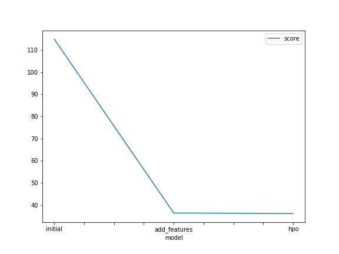
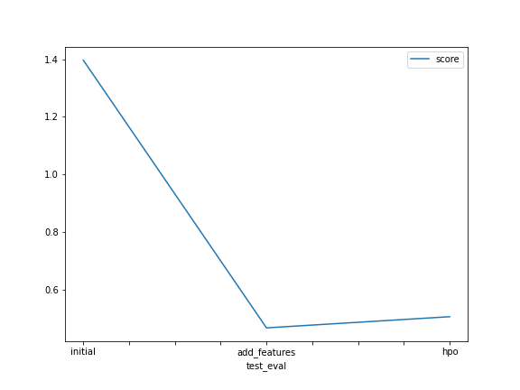

# Report: Predict Bike Sharing Demand with AutoGluon Solution
#### Alisher Karibzhanov

## Initial Training
### What did you realize when you tried to submit your predictions? What changes were needed to the output of the predictor to submit your results?
The result may contain negative numbers. These negative numbers should be changed to 0 before submission to Kaggle, otherwise submission will be failed.

### What was the top ranked model that performed?
The top ranked model is `WeightedEnsemble_L2`. This model performed well after hyperparameters tuning on train data, but didn't perform well on test data.

## Exploratory data analysis and feature creation
### What did the exploratory analysis find and how did you add additional features?
Plotting histograms showed that `season` and `weather` features look more like `category` type. So these features were converted to `category` type.
I assumed that hour is an important information about bike sharing, so I added additional `hour` feature to train and test data.

### How much better did your model preform after adding additional features and why do you think that is?
Before adding new feature the Kaggle score was `1.39682`, after adding `hour` feature became `0.46639`, which is a significant improvement. I think hour gives us valuable information about sharing bike, because people are more likely to ride a bike during the day rather than at night.

## Hyper parameter tuning
### How much better did your model perform after trying different hyper parameters?
The Kaggle score worsened from `0.46639` to `0.50523`.

### If you were given more time with this dataset, where do you think you would spend more time?
I would spend time on removing outliers, tuning hyperparameters and feature engineering.

### Create a table with the models you ran, the hyperparameters modified, and the kaggle score.
|model|time_limit|hyperparameter|hyperparameter_tune_kwargs|score|
|--|--|--|--|--|
|initial|10 minutes|default|default|1.39682|
|add_features|10 minutes|default|default|0.46639|
|hpo|10 hours|'GBM', 'NN': 'RF', 'XT', 'FASTAI', 'KNN'|'num_trials':1000|0.50523|

### Create a line plot showing the top model score for the three (or more) training runs during the project.

### Create a line plot showing the top kaggle score for the three (or more) prediction submissions during the project.

## Summary
The goal of the project is to predict bike sharing demand using Autogluon.
Initial Kaggle submission was scored `1.39682`.
After adding new `hour` feature, the Kaggle submission was scored `0.46639`, which is a great improvement.
After hyperparameters tuning, the Kaggle submission was scored `0.50523`.