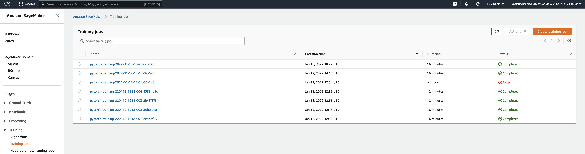
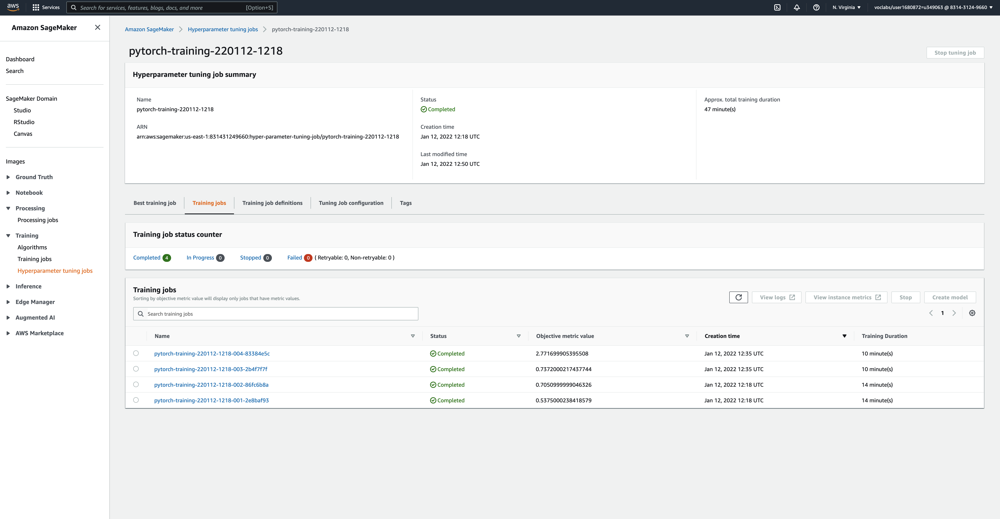
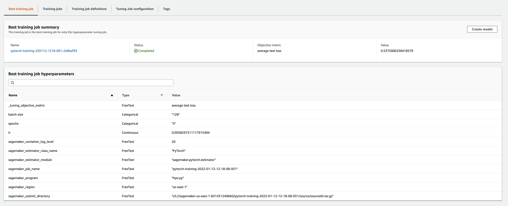
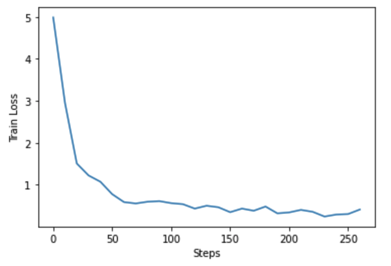
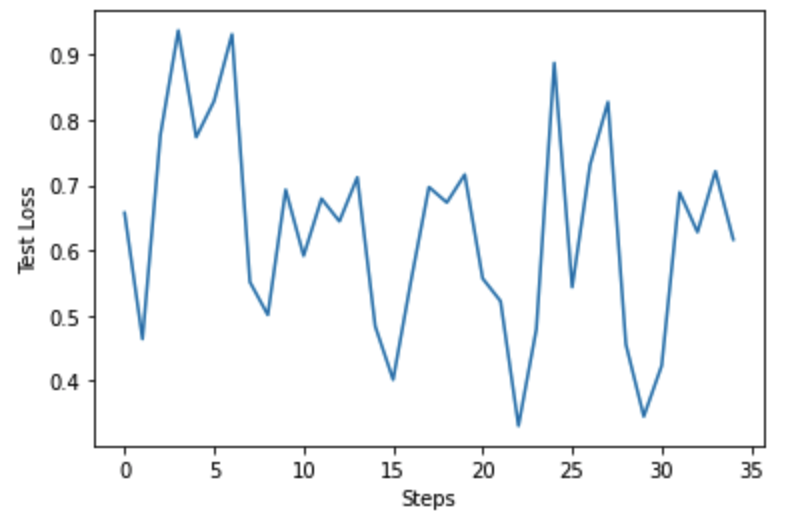
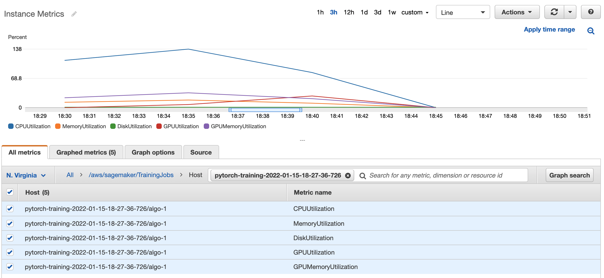
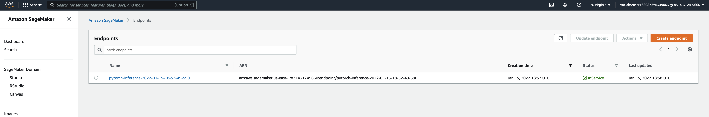
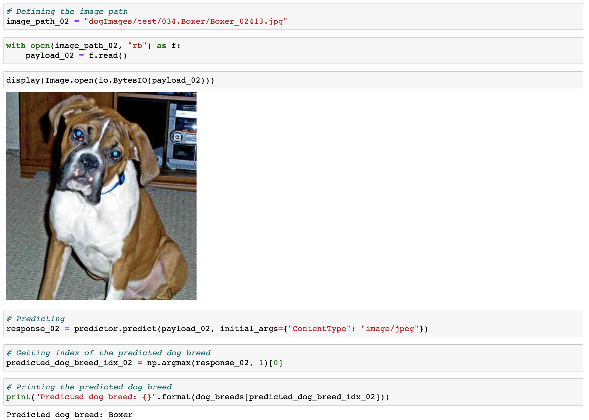
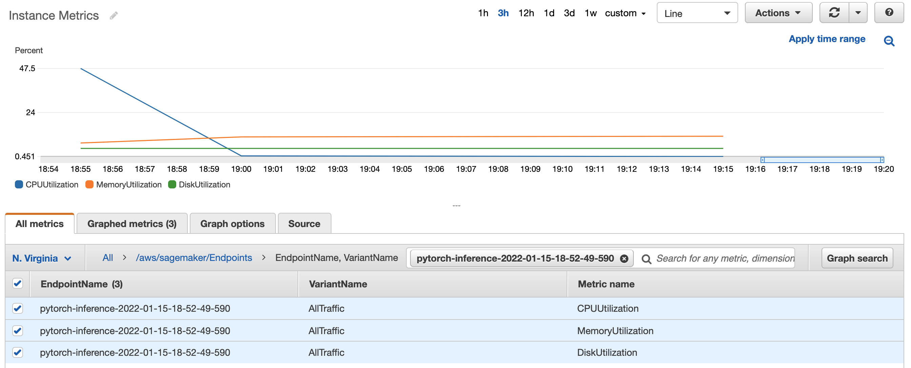
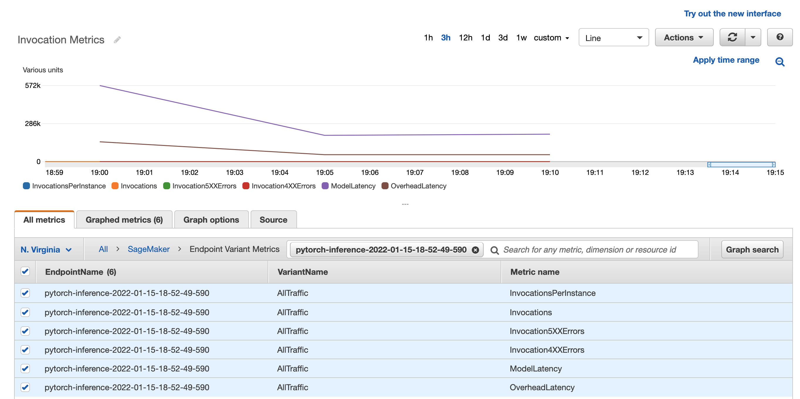

# Image Classification using AWS SageMaker

Use AWS Sagemaker to train a pretrained model that can perform image classification by using the Sagemaker profiling, debugger, hyperparameter tuning and other good ML engineering practices. This can be done on either the provided dog breed classication data set or one of your choice.

## Project Set Up and Installation
Enter AWS through the gateway in the course and open SageMaker Studio. 
Download the starter files.
Download/Make the dataset available.

## Dataset
The provided dataset is the dogbreed classification dataset which can be found in the classroom.
The dataset consists of 8351 colour images of 133 classes (dog breeds). The dataset is divided to train, valid and test dataset with 6680, 835 and 836 images respectively.

### Access
Upload the data to an S3 bucket through the AWS Gateway so that SageMaker has access to the data. 

## Hyperparameter Tuning
* I choosed the [Inception-v3](https://cloud.google.com/tpu/docs/inception-v3-advanced) model with additional one fully connected layer. Inception-v3 is a widely-used image recognition model that has been shown to attain greater than 78.1% accuracy on the ImageNet dataset. Inception-v3 is a convolutional neural network that is 48 layers deep.
* The optimizer we use is [Adam](https://pytorch.org/docs/stable/generated/torch.optim.Adam.html)
* I selected these hyperparameters for tuning:
	* **Learning rate** - learning rate defines how fast the model trains. A large learning rate allows the model to learn faster, with a small learning rate it takes a longer time for the model to learn but with more accuracy. The range is from `0.001` to `0.1`.
	* **Batch size** - batch size is the number of examples from the training dataset used in the estimate of the error gradient. Batch size controls the accuracy of the estimate of the error gradient when training neural networks. The batch size is chosen between two numbers `64` and `128`.
	* **Epochs** - epochs is the number of times that the learning algorithm will work through the entire training dataset. The epochs is chosen between two numbers `2` and `5`.
* The best hyperparameters that are chosen: `{'batch-size': '128', 'lr': '0.0038297311117915494', 'epochs': '5'}`

### All Training Jobs

### Hyperparameters Tuning Jobs

### Best Hyperparameters Tuning Job

## Debugging and Profiling
### Debugging Report
Two plots show dependence between loss and step: first one shows the `train_loss/steps`, the second one shows the `test_loss/steps`.
### Train loss plot:

### Test loss plot:

### Profiling Report
Here are instance metrics of the best hyperparameters training job

For more detailed report watch [profiler-report.html](ProfilerReport/profiler-output/profiler-report.html)

### Results
As we see there are some anomalous behaviour in the debugging output:
1. In the `train_loss/steps` as steps are increased the loss is decreased. The graph is smooth.
2. In the `test_loss/steps` as steps are increased we cannot say the loss is decreased. The graph isn't smooth.

Here are some ways that may help to fix that:
1. Adding more hyperparameters to tune.
2. Increasing hyperparameter ranges for hpo tuning.
3. Increasing `max_jobs` for hpo tuning.
4. Adding more Fully Connected layers to the pretrained model.

## Model Deployment
The model is deployed using `inference.py` script.

### Deployed the Endpoint

### Instructions on how to Query the Endpoint with a Sample Input
* The dog images I use must be downloaded from [here](https://s3-us-west-1.amazonaws.com/udacity-aind/dog-project/dogImages.zip).
* Test images I use are stored in the `dogImages/test/` folder.
* Scripts to predict on the Endpoint:
	* store image path in `image_path`
	* prepare image and store it as `payload`:
		`with open(image_path, "rb") as f: payload = f.read()`
	* run prediction:
		`response = predictor.predict(payload, initial_args={"ContentType": "image/jpeg"})`

### Test prediction
In `train_and_deploy.ipynb` I run 4 test predictions, and the predictions are pretty accurate.

Here is an example of a prediction:

### Endpoint Instance Metrics

### Endpoint Invocation Metrics
