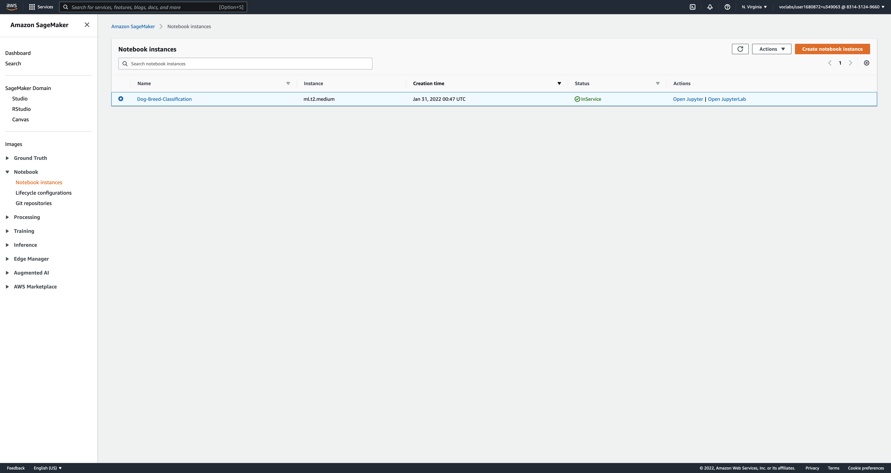

# Project №4: Dog Breeds Classification
In this project we learn:
1. use AWS resources efficiently and optimally
2. set up multi-instance training
3. set up auto-scaling for endpoints, so it allows to process requests on multiple instances
4. set up concurrency for lambda functions, so it helps to decrease the latency of a project in a high-traffic situations
5. set up policies to AWS roles

## Write-up
The [writeup.pdf](writeup.pdf) includes answers to questions that were asked in each of the Steps of the project.

## Screenshots
Here are screenshots I made:

### Notebook instance

### S3 bucket setup

### Deployed endpoint

### TrainedModels directory in EC2 instance

### Successful lambda test event

### Attached policies to lambda function's role
