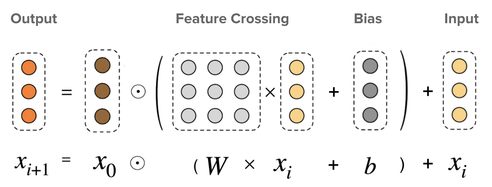

# Machine Learning Engineer Nanodegree
# Capstone Proposal
Alisher Karibzhanov, February 28th, 2022

The project is a Kaggle competition, [H&M Personalized Fashion Recommendations](https://www.kaggle.com/c/h-and-m-personalized-fashion-recommendations).

## Domain Background
The H&M online store offers shoppers an extensive selection of products to browse through. But with too many choices, customers might not quickly find what interests them or what they are looking for, and ultimately, they might not make a purchase. To enhance the shopping experience, product recommendations are key. More importantly, helping customers make the right choices also has a positive implications for sustainability, as it reduces returns, and thereby minimizes emissions from transportation.

My personal motivation to solving the problem is joining a Kaggle competition, interacting with fellow machine learning practitioners.

## Problem Statement
The H&M wants us to develop product recommendations based on data from previous transactions, as well as from customer and product meta data. The available meta data spans from simple data, such as garment type and customer age, to text data from product descriptions, to image data from garment images.

The challenge is to predict what articles each customer will purchase in the 7-day period immediately after the training data ends based on their previous consumptions. Customer who did not make any purchase during that time are excluded from the scoring.

## Datasets and Inputs
These are 3 datasets will be used in the problem:

### 1. `articles.csv`
`articles.csv` - detailed metadata for each `article_id` available for purchase. The file contains **105,542** rows and **25 columns**:
1. `article_id` - unique identifier key of every article, `categorical feature`
2. `product_code` - identifier of every product, `categorical feature`
3. `prod_name` - name of a product, `categorical feature`
4. `product_type_no` - identifier of every product's type, `categorical feature`
5. `product_type_name` - name of a product's type, `categorical feature`
6. `product_group_name` - name of a product's group, `categorical feature`
7. `graphical_appearance_no` - identifier of every product's appearance, `categorical feature`
8. `graphical_appearance_name` - name of a appearance's appearance, `categorical feature`
9. `colour_group_code` - identifier of every group color, `categorical feature`
10. `colour_group_name` - name of a group color, `categorical feature`
11. `perceived_colour_value_id` - identifier of every product's perceived colour, `categorical feature`
12. `perceived_colour_value_name` - name of a product's perceived colour, `categorical feature`
13. `perceived_colour_master_id` - identifier of every product's perceived master colour, `categorical feature`
14. `perceived_colour_master_name` - name of a product's perceived master colour, `categorical feature`
15. `department_no` - identifier of every department, `categorical feature`
16. `department_name` - name of a department, `categorical feature`
17. `index_code` - identifier of every index, `categorical feature`
18. `index_name` - name of an index, `categorical feature`
19. `index_group_no` - identifier of every index group, `categorical feature`
20. `index_group_name` - name of an index group, `categorical feature`
21. `section_no` - identifier of every section, `categorical feature`
22. `section_name` - name of a section, `categorical feature`
23. `garment_group_no` - identifier of every garment, `categorical feature`
24. `garment_group_name` - name of a garment, `categorical feature`
25. `detail_desc` - details of an article, `categorical feature`

### 2. `customers.csv`
`customers.csv` - metadata for each `customer_id` in dataset. The file contains **1,371,980 rows** and **7 columns**:
1. `customer_id` - unique identifier of every customer
2. `FN` - 1 or NULL
3. `Active` - if a customer is active or not
4. `club_member_status` - customer's club membership status
5. `fashion_news_frequency` - how often H&M sends news to a customer
6. `age` - customer's age
7. `postal_code` - customer's postal code

### 3. `transactions_train.csv`
`transactions_train.csv` - the training data, consisting of the purchases each customer for each date for 24 months, as well as additional information. Duplicate rows correspond to multiple purchases of the same item. Your task is to predict the `article_id`s each customer will purchase during the 7-day period immediately after the training data period. The file contains **31,788,324 rows** and **5 columns**:
1. `t_dat` - transaction date
2. `customer_id` - identifier of a customer
3. `article_id` - identifier of an article
4. `price` - transaction price
5. `sales_channel_id` - sales channel

**NOTE:** We must make predictions for all `customer_id` values found in the `customers.csv`. All customers who made purchases during the test period are scored, regardless of whether they had purchase history in the training data.

The data is available [here](https://www.kaggle.com/c/h-and-m-personalized-fashion-recommendations/data)

## Solution Statement
There are several approaches we can use for the project:
1. The first approach, using `collaborative filtering`, is to filter data from user purchases to make personalized recommendations for users with similar preferences.
2. The second approach, using `content-based filtering`, is to correlate variables to a product acquired, and predict for each customer the likelihood of the customer buying or not each product. That can be done since we have information of which products were acquired in the past by a particular customer.
3. The third approach is to combine the first approach and the second approach.

## Benchmark Model
The models I am going to use:
### 1. `Deep & Cross Network (DCN)`
DCN was designed to learn explicit and bounded-degree cross features effectively. It starts with an input layer (typically an embedding layer), followed by a `cross network` containing multiple cross layers that models explicit feature interactions, and then combines with a `deep network` that models implicit feature interactions.
* `Cross Network`. This is the core of DCN. It explicitly applies feature crossing at each layer, and the highest polynomial degree increases with layer depth. The following figure shows the (*i+1*)-th cross layer.

* `Deep Network`. It is a traditional feedforward multilayer perceptron (MLP).

The deep network and cross network are then combined to form DCN. Commonly, we could stack a deep network on top of the cross network (stacked structure); we could also place them in parallel (parallel structure).

 

For more details about DCN read [this](https://arxiv.org/pdf/2008.13535.pdf) and [this](https://static.googleusercontent.com/media/research.google.com/en//pubs/archive/18fa88ad519f25dc4860567e19ab00beff3f01cb.pdf) articles

### 2. `Recurrent Neural Networks (RNN)`
Using RNN we are going to build a sequential retrieval model. Sequential recommendation is a popular model that looks at a sequence of items that users have interacted with previously and then predicts the next item.

For more details about RNN read [this](https://arxiv.org/abs/1511.06939) article.

## Evaluation Metrics
The evaluation metric is already defined by the competition to be the `Mean Average Precision @ 12 (MAP@12)`:

where
1. in `Mean Average Precision @ 12 (MAP@12)` the `12` means the number of maximum predictions per customer,
2. `U` is the number of customers,
3. `P(k)` is the precision at cutoff `k`. `P(k) = p/k`, where `p` corresponds to the number of correct predictions among first `p` articles,
4. `n` is the number predictions per customer,
5. `rel(k)` is an indicator function equaling `1` if the item at rank `k` is a relevant (correct) label, zero otherwise.

**NOTES:**
* We will be making purchase predictions for all `customer_id` values provided, regardless of whether these customers made purchases in the training data.
* Customer that did not make any purchase during test period are excluded from the scoring.
* There is never a penalty for using the full 12 predictions for a customer that ordered fewer than 12 items; thus, it's advantageous to make 12 predictions for each customer. This means for better score we should make the full 12 predictions for each customer.

## Project Design
The workflow for approaching a solution:
1. `Data Analysis`: understand the datasets
2. `Features Transformation`: convert variables into features. Standardize/normalize features, apply numerical transformations, perform one-hot encoding, etc.
3. `Features Creation`: analyse the possibility of deriving new features from the existing ones
4. `Features Selection`: select relevant features
5. `Extraction`: extract main features by extracting principal components
6. `Machine Learning Models`: apply different strategies. For each strategy, optimize with the best choice of algorithm and parameters.
7. `Evaluation`: evaluate the performance of each strategy, and check possibilities of combining them to extract the best of each one and achieving an optimal model.
8. `Deployment`: deploy the trained model to an AWS endpoint.
9. `Lambda & Step Functions`: set up a AWS Lambda & Step Function for calling the deployed model.
